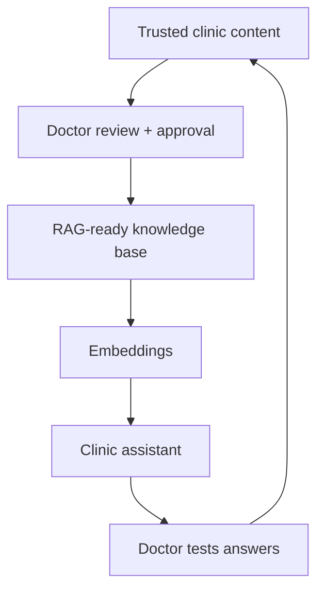
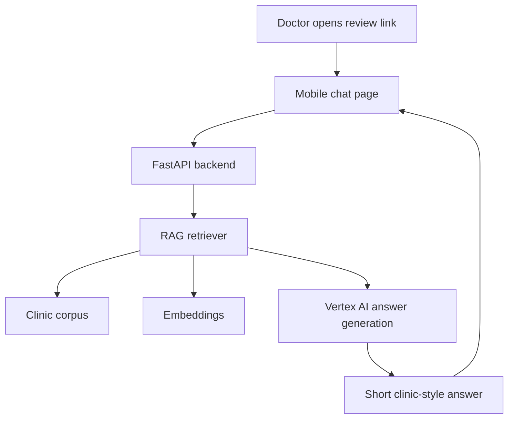
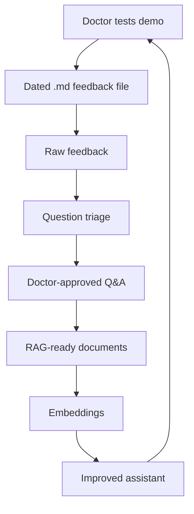
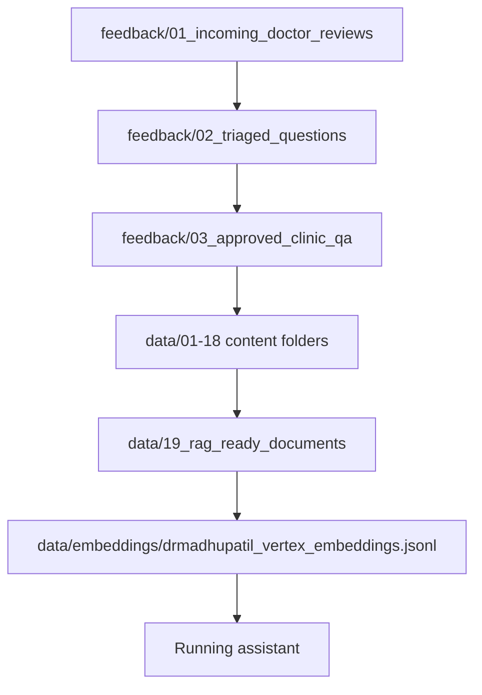
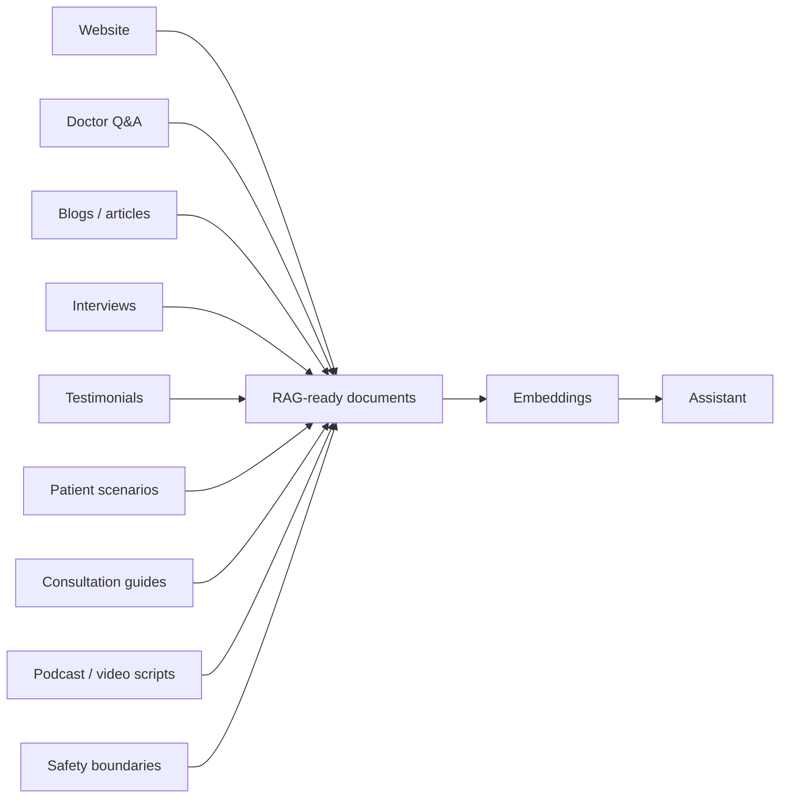
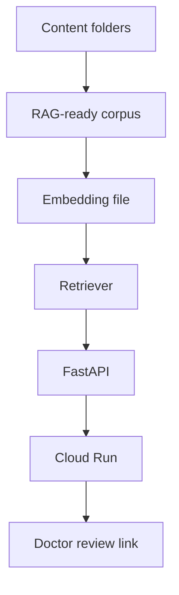
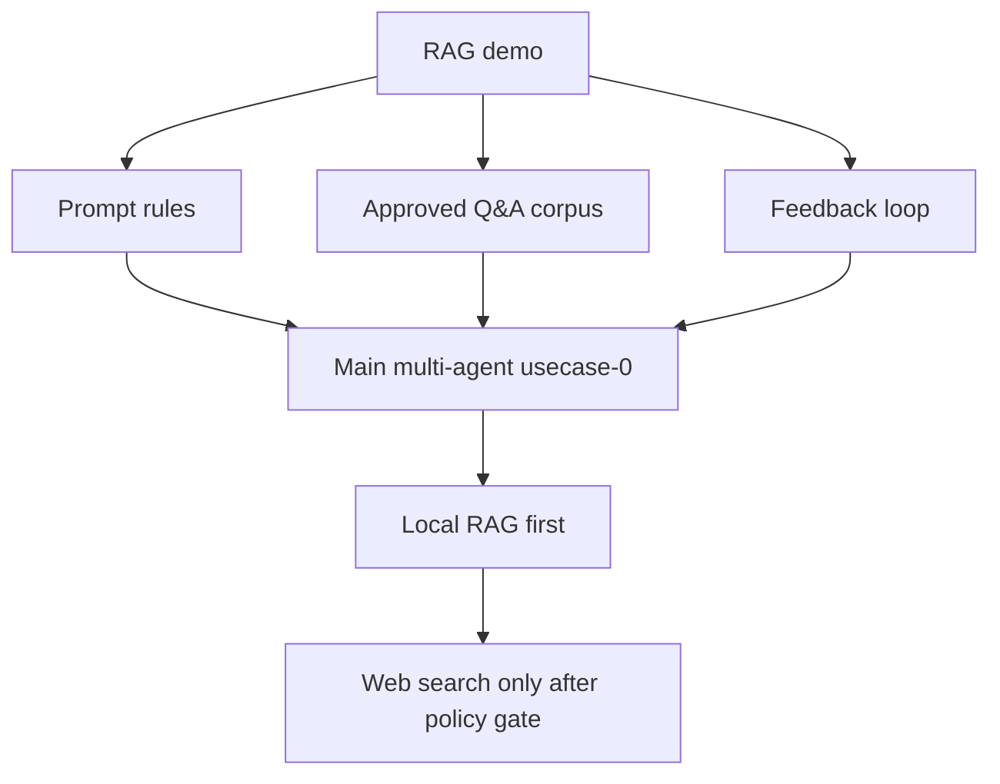

# Dr. Madhu Patil Clinic RAG Demo - Simple Project Overview

This project is a clinic knowledge assistant demo for Dr. Madhu Patil's Clinic.

The goal is simple:

```text
Collect trusted clinic content
        ↓
Turn it into clean Q&A and education material
        ↓
Add it to the assistant's knowledge base
        ↓
Test the assistant
        ↓
Improve the answers continuously
```

## Visual Summary



## 1. What This Demo Does

The demo lets a reviewer or doctor ask patient-style questions such as:

- What is IVF?
- What tests are needed for fertility assessment?
- Can PCOS affect fertility?
- What should I bring for my first consultation?
- What can be done after a failed IVF cycle?
- What do patients say about the doctor?

The assistant answers using the clinic's approved content and shows a source/grounding reference below the answer.

## 1A. What Runs When Someone Opens The Demo



## 2. Why We Built This

This project helps us improve the assistant before it becomes part of the larger multi-agent system.

It is useful for:

- Testing real patient questions.
- Finding missing clinic content.
- Creating better doctor-approved answers.
- Improving the website and assistant together.
- Reducing unnecessary external web search.
- Building a safe, trusted clinic knowledge base.

## 3. How The Improvement Loop Works

```text
Doctor tests the demo
        ↓
Doctor shares the full chat questions and feedback
        ↓
We save the raw feedback
        ↓
We classify and clean the questions
        ↓
Doctor-approved answers are created
        ↓
Approved content is added to the RAG knowledge base
        ↓
Embeddings are rebuilt
        ↓
The demo is tested again
```

This is an ongoing process. The assistant gets better as more doctor-approved content is added.

Visual flow:



## 4. Where Doctor Feedback Goes

Raw doctor feedback goes here:

```text
feedback/01_incoming_doctor_reviews/
```

Example file:

```text
2026_06_27_doctor_chat_review_initial.md
```

This file should be the original conversation or feedback exactly as received.

## 5. How Feedback Becomes Approved Content

After raw feedback is received, it moves through these stages:

```text
feedback/01_incoming_doctor_reviews/
        ↓
feedback/02_triaged_questions/
        ↓
feedback/03_approved_clinic_qa/
        ↓
data content folders
        ↓
data/19_rag_ready_documents/
        ↓
data/embeddings/
```

The important embedding reference is:

```text
data/embeddings/drmadhupatil_vertex_embeddings.jsonl
```

Everything before this file is content preparation. Everything after this file is used by the running assistant.

Visual reference:



## 6. Content Folders

The project has separate folders for different types of clinic content.

```text
data/01_source_website_corpus/
```
Official website pages such as service pages, doctor profile, blog pages, and FAQs.

```text
data/02_approved_qa_corpus/
```
Doctor-approved Q&A created from real patient questions or demo testing.

```text
data/03_public_engagement_corpus/
```
Articles, blogs, educational notes, and public engagement content.

```text
data/04_trust_social_proof_corpus/
```
Testimonials, video transcripts, Google Business Profile review summaries, and ratings snapshots.

```text
data/05_patient_journey_scenarios/
```
Patient situations such as trying for pregnancy for several years, failed IVF, PCOS, age-related concerns, or family pressure.

```text
data/06_consultation_guides/
```
First-visit preparation, reports to bring, what to expect in consultation, and appointment guidance.

```text
data/07_treatment_decision_explainers/
```
Educational explanations about when IUI, IVF, ICSI, or fertility preservation may be discussed.

```text
data/08_myth_vs_fact/
```
Common myths and facts about fertility, IVF, PCOS, male fertility, and pregnancy.

```text
data/09_post_treatment_followup_guidance/
```
General guidance after IUI, embryo transfer, failed IVF, positive beta-hCG, or follow-up visits.

```text
data/10_emotional_support_content/
```
Supportive content for stress, fear, family pressure, repeated failures, and emotional concerns.

```text
data/11_male_fertility_faqs/
```
Male fertility questions such as low sperm count, zero sperm count, motility, morphology, and semen analysis.

```text
data/12_age_based_fertility_planning/
```
Fertility planning by age group, including after 35, after 40, and fertility preservation timing.

```text
data/13_safety_and_boundaries/
```
Questions the assistant should not answer directly, such as emergency symptoms, medication dosage, report interpretation, or personalized treatment decisions.

```text
data/14_doctor_clinical_philosophy/
```
Dr. Madhu Patil's care philosophy, counselling style, patient comfort, realistic expectations, and individualized approach.

```text
data/15_podcast_and_video_scripts/
```
Podcast scripts, video scripts, reels, shorts, webinar transcripts, and doctor interview scripts.

```text
data/16_events_webinars_workshops/
```
Event notes, webinar Q&A, workshop content, and fertility awareness material.

```text
data/17_media_pr_interviews/
```
Media interviews, PR content, newspaper/magazine answers, and public doctor-profile material.

```text
data/18_doctor_notes_and_clinic_protocols/
```
Doctor notes or protocol summaries. This folder must be handled carefully. Some content may be internal-only and should not be added to the patient-facing assistant.

## 7. File Naming Rule

Every content file should start with a date.

Use this format:

```text
YYYY_MM_DD_topic_short_description[_status_or_version].md
```

Examples:

```text
2026_06_27_doctor_chat_review_initial.md
2026_06_27_approved_clinic_qa_ivf_success_doctor_approved.md
2026_06_28_patient_journey_trying_for_4_years_draft.md
2026_06_28_myth_vs_fact_ivf_twins_doctor_review.md
2026_06_29_podcast_script_ivf_expectations_v1.md
```

Useful status words:

```text
_draft
_doctor_review
_doctor_approved
_needs_revision
_archived
_v1
_v2
```

## 8. What Should Be Approved Before Adding

Content should be approved before it becomes assistant knowledge.

Especially review:

- Treatment claims.
- Success-rate statements.
- Patient testimonial summaries.
- Doctor philosophy and interview answers.
- Medical safety boundaries.
- Any content from clinic protocols.

The assistant should educate and guide, but it should not diagnose, prescribe, interpret reports, or guarantee outcomes.

## 9. Website Content vs Markdown Content

Preferred approach:

```text
Public, stable, brand-ready content → publish on website first
Fast improvement or doctor feedback → provide as Markdown first
```

Both can later feed the assistant.

Website content is best for public authority and source links. Markdown content is best for quick iteration and doctor-reviewed improvements.

## 9A. Complete Content Architecture



## 10. Simple Folder Map

```text
rag-usecase-0/
  docs/
    Project maps and operating instructions

  feedback/
    Raw doctor feedback, triage notes, approved Q&A

  data/
    Numbered content folders
    RAG-ready documents
    Embeddings
    Runtime references

  backend/
    API and retrieval logic

  frontend/
    Chat review page

  scripts/
    Deployment and smoke-test scripts
```

## 10A. Execution Awareness

This project has three execution layers:

```text
1. Content layer
   feedback/ and data/ folders

2. RAG/runtime layer
   data/corpus/
   data/embeddings/
   backend/app/rag/

3. Demo/deployment layer
   frontend/
   backend/app/main.py
   scripts/
   Cloud Run
```

Visual execution map:



## 11. Current Active Runtime Files

The running demo currently uses:

```text
Corpus:
data/corpus/drmadhupatil_enriched_rag_corpus.jsonl

Metadata manifest:
data/corpus/metadata_enrichment_manifest.json

Embeddings:
data/embeddings/drmadhupatil_vertex_embeddings.jsonl
```

## 12. Final Idea

This project is not a one-time chatbot.

It is a continuous clinic knowledge improvement system:

```text
Real questions
        ↓
Doctor-approved answers
        ↓
Better content
        ↓
Better embeddings
        ↓
Better assistant responses
```

The more high-quality clinic content we add, the more useful and trustworthy the assistant becomes.

## 13. Link To The Main Multi-Agent Project

This RAG demo is separate from the main multi-agent project, but it directly supports it.

The demo gives us:

- Final prompt engineering rules.
- Doctor-approved content.
- Patient question patterns.
- Web-search gating policy.
- A repeatable content improvement loop.

These learnings will move into the main multi-agent `usecase-0` and later `usecase-1`.



More diagrams are available here:

```text
docs/03_ARCHITECTURE.md
```
