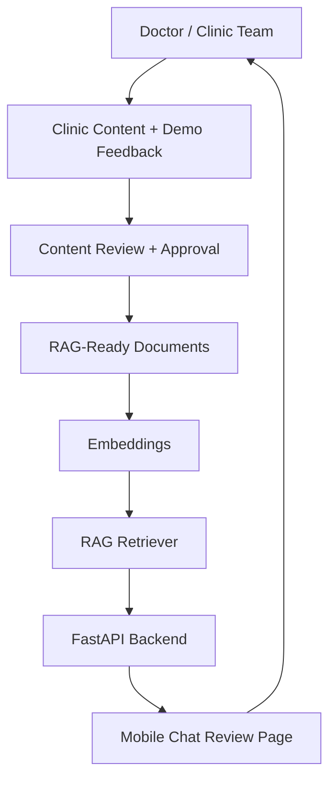
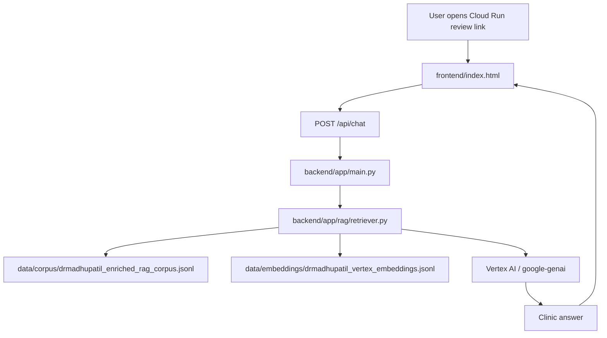
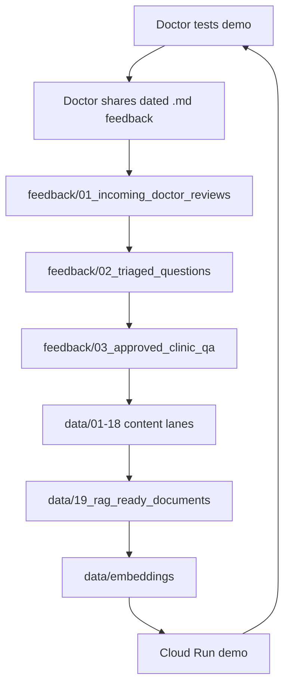
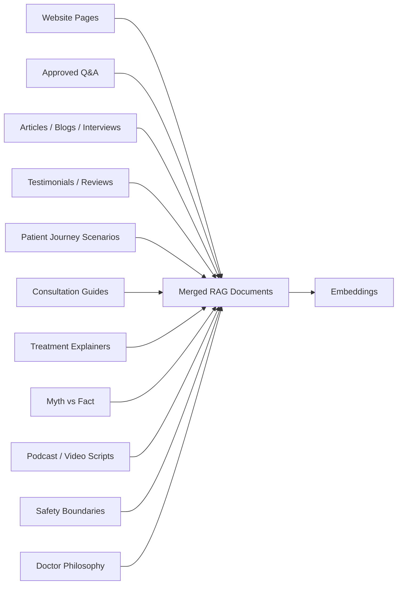
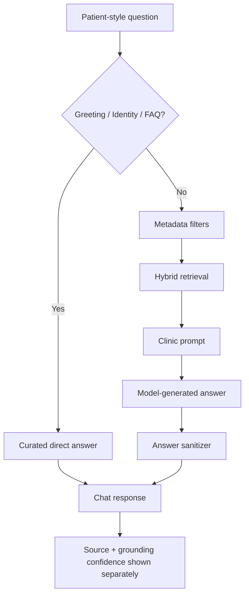
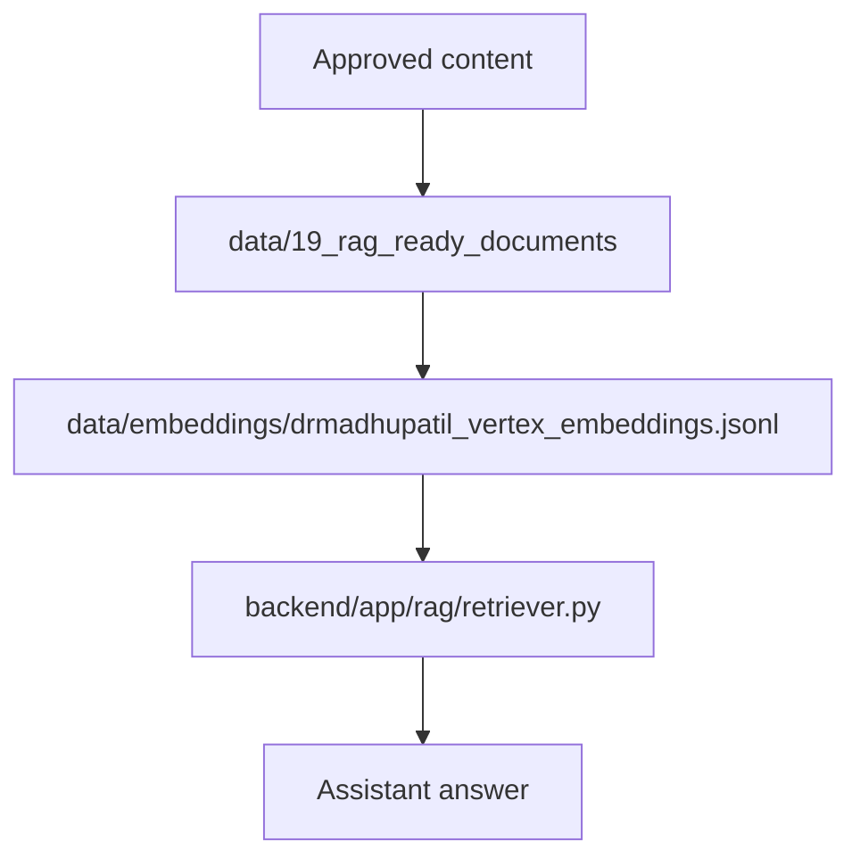
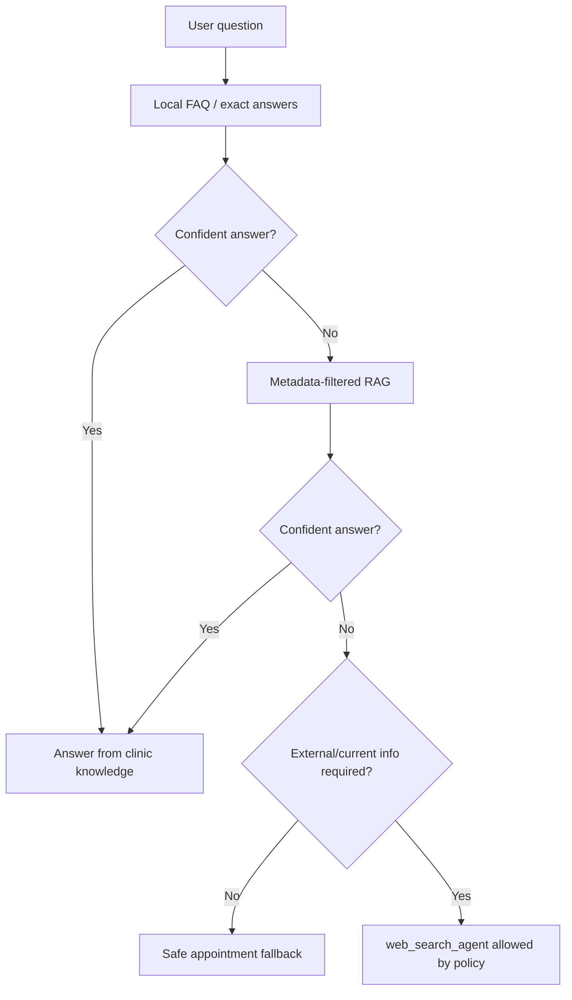
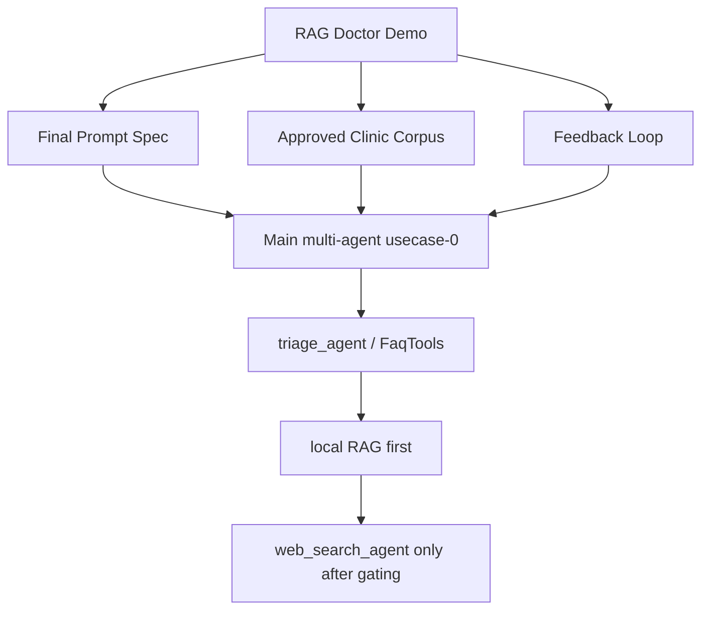

# RAG Demo Architecture

This document explains the full project and execution flow using simple diagrams.

## 1. Overall Project Architecture

## 2. Current Runtime Architecture

## 3. Content Improvement Loop

## 4. Content Lane Sub-Architecture

## 5. RAG Answer Runtime

## 6. Embedding Reference Point

## 7. Web Search Gating For Main Multi-Agent Project

## 8. How This Connects Back To Multi-Agent Usecase-0

